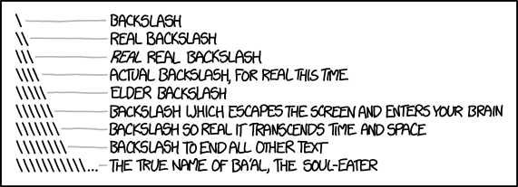

---
# Copyright 2025 by Clement Lee
# This file may be distributed and/or modified
# under the GNU Public License (>= 3).
title: "University R Markdown Template" # this gets overridden by the header-includes below when output is beamer_presentation
subtitle: "An attempt to match the core brand assets"
author: "Your Name"
date: "November 27, 2025"
output: 
  bookdown::beamer_presentation2:
    theme: "NewcastleUniversity"
    latex_engine: xelatex
    slide_level: 2
    toc: false
classoption: "aspectratio=169"
bibliography: references.bib
header-includes:
  - \AtBeginDocument{\title[Template short title]{University R Markdown Template}}
---

## Introduction

This is the template for creating beamer presentations via R Markdown, using the style file (`beamerthemeNewcastleUniversity.sty`) that is based on the PowerPoint template in the University's asset library.

# Basic elements

## Bullet points

* **Above cyan line**: short title of the presentation if exists, otherwise the presentation title.
* *Top Right*: logo.
* *Below cyan line*: frame heading.
* `Below red line`: slogan.

## Colours

1. We can make custom colours using the \texttt{\textbackslash textcolor} command e.g. \textcolor{red}{red}.
2. Note that \LaTeX commands are used to make this work.
3. See next section on general colour scheme and background colours.

## Equations
  $$\pi=3.14159265...$$

  \begin{equation}
    e^{i\pi}+1=0
  \end{equation}

## Theorems & proofs

::: {.theorem name="Euler's identity" #euler-identity}
$e^{i\pi}+1=0$
:::

The proof of Theorem \@ref(thm:euler-identity) is as below:

::: {.proof}
\begin{align*}
  e^{i\pi}+1&=\cos\pi+i\sin\pi+1\\
  &=-1+i\times0+1=0
\end{align*}
:::

## Pictures

```{r, echo = FALSE, out.width = "80%"}
#| fig.cap: "https://xkcd.com/1638/"

```

## Using references

* We can cite others via bibliography management.
* This means putting the references in a `.bib` file, and using an `@` command when citing.
* Example: @dbc21

# Dynamic generation of results using `R`

## Code and Data
```{r setup}
#| echo: false
knitr::opts_chunk$set(dev.args = list(bg = "white"))
```

```{r}
#| highlight: false
head(cars)
```

## Plots
```{r}
#| echo: false
#| out.width: "80%"
#| fig.asp: 0.5
#| fig.align: "center"
plot(cars)
```

# Features to add

## Colours

* Currently this theme doesn't support blue on white, unlike the PowerPoint template
* This likely requires another style file, or adding an option in the current style file
* Also, it's unlikely to have slides of both colour schemes in a presentation

* Colour of whatever title above cyan line?

## Table of contents

* Currently, adding `toc: true` in the yaml doesn't render the table of contents properly

* There's no such problem for the \LaTeX template

## Section heading

* A long section heading will get split into multiple lines
* Subsequent lines doesn't get indented - to be fixed

## References